<h1 align="center">Hi, I'm MrJulsen 🐉</h1>

  

  
  
  

  
  

    <b>
        Self-taught Java and C# programmer since 2017, building Minecraft mods as a hobby for a large community with several million downloads and Trainee IT Specialist for System Integration.
        I'm currently <!--AGE-->24<!--/AGE--> years old and from Bavaria, Germany.
    </b>

<i>🐉 “Mastering code is like riding a dragon. 
Knowing its nature won't teach you to fly — 
you climb on, hold tight, and learn mid-flight.”</i>

---

### About Me

- 👨‍💻 Currently training as an **IT Specialist for System Integration**
- 🧑‍🎓 Self-taught programmer since **2017** — coding started as a hobby, long before my apprenticeship
- 🔧 Passionate **Minecraft modder**
- 🚂 Favorite problem to solve: pathfinding & interconnected in-game systems
- 📝 Favorite languages: Java, C#
- 🌐 More about me & my projects: **[mrjulsen.net](https://mrjulsen.net)**

---

### Currently Interested In

  
  
  
  

---

### Featured Projects

<table>
  <tr>
    <td width="15%" align="center">
      
    </td>
    <td width="35%">
      <h4><a href="https://github.com/MisterJulsen/TrafficCraft">TrafficCraft</a></h4>
      Roads, traffic signs, traffic lights and much more for your Minecraft worlds.
        
      
      
    </td>
    <td width="15%" align="center">
      
    </td>
    <td width="35%">
      <h4><a href="https://github.com/MisterJulsen/Create-Train-Navigator">Create Train Navigator</a></h4>
      Find possible train connections between stations. An addon for the Create Mod.
        
      
      
    </td>
  </tr>
  <tr>
    <td width="15%" align="center">
      
    </td>
    <td width="35%">
      <h4><a href="https://github.com/MisterJulsen/Create-Pantographs-and-Wires">Create: Pantographs & Wires</a></h4>
      Catenary wires, pantographs and more for electric modern trains in Create.
        
      
      
    </td>
    <td width="15%" align="center">
      
    </td>
    <td width="35%">
      <h4><a href="https://github.com/MisterJulsen/MC-DragonLib2">MC-DragonLib2</a></h4>
      A small, simple multiloader Minecraft library mod using Architectury.
        
      
      
    </td>
  </tr>
</table>

---

### Tech Stack

  
  
  
  

---

### GitHub Stats

  
  

  

  

---

  
  

---

<i>👋 Thanks for stopping by!</i>

